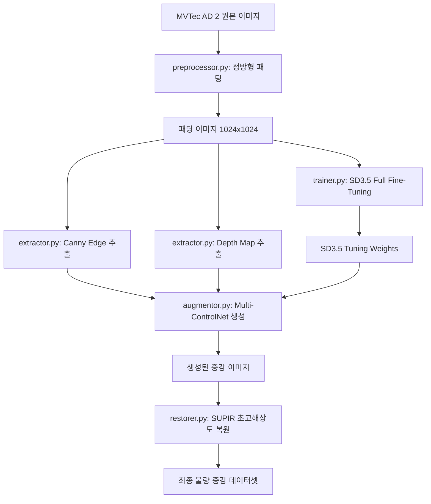

# KKCC Model B 파이프라인 구현 가이드

본 문서는 [pipeline.md](file:///D:/wiki/wiki/projects/KKCC/pipeline.md)에 기술된 **model B 전용 MVTec AD 2 불량 데이터 증강 파이프라인**을 실제 파이썬 프로그램으로 구현하기 위한 아키텍처 설계도 및 스켈레톤 코드 명세서입니다. 유지보수와 모듈화를 극대화하기 위해 각 구성 요소를 독립적인 파이썬 파일로 구성하며, `main.py`에서 총괄 제어하도록 설계되었습니다.

---

## 📦 전체 시스템 아키텍처

