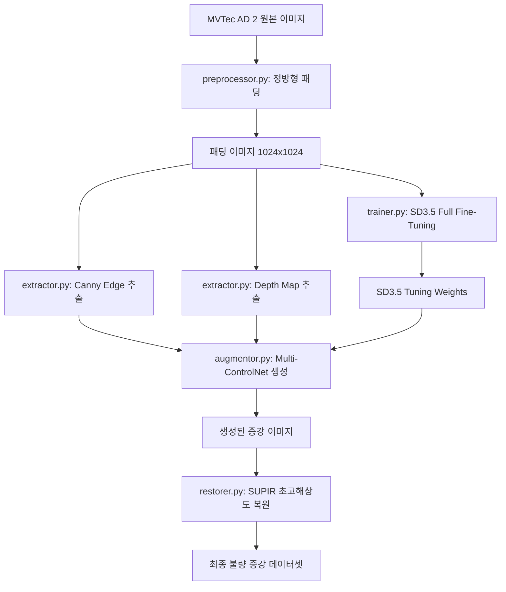

# KKCC Model B 파이프라인 구현 가이드

본 문서는 [pipeline.md](file:///D:/wiki/wiki/projects/KKCC/pipeline.md)에 기술된 **model B 전용 MVTec AD 2 불량 데이터 증강 파이프라인**을 실제 파이썬 프로그램으로 구현하기 위한 아키텍처 설계도 및 스켈레톤 코드 명세서입니다. 유지보수와 모듈화를 극대화하기 위해 각 구성 요소를 독립적인 파이썬 파일로 구성하며, `main.py`에서 총괄 제어하도록 설계되었습니다.

---

## 📦 전체 시스템 아키텍처



---

## 🛠️ 환경 구성 (Requirements.txt)

구현에 앞서 다음 라이브러리 설치 및 GPU 환경(NVIDIA CUDA 12.x 이상, VRAM 24GB 이상 권장)이 필요합니다.

```text
torch>=2.1.0
torchvision
transformers>=4.40.0
diffusers>=0.28.0
accelerate>=0.29.0
opencv-python>=4.8.0
numpy
pillow
triton
# SUPIR 설치 (https://github.com/Fanghua-Yu/SUPIR 참고)
```

---

## 💻 모듈별 상세 구현 스켈레톤

### 1. `preprocessor.py`
* **역할**: 원본 이미지의 비율을 깨뜨리지 않고 여백을 흰색으로 채워 $1024 \times 1024$ 정방형 이미지로 가공합니다.
* **기반 개념**: [ImageSquarePadder 분석](file:///D:/wiki/wiki/wiki/python/kkcc/image-square-padder.md) 클래스를 기반으로 구현되었습니다.

```python
import os
import glob
from PIL import Image

class ImageSquarePadder:
    """이미지를 비율 유지하며 조정하고, 빈 공간을 흰색으로 채우는 클래스"""
    def __init__(self, target_size=1024):
        self.target_size = (target_size, target_size)

    def process(self, image_path: str) -> Image.Image:
        image = Image.open(image_path).convert("RGB")
        # 비율 유지하며 액자 크기 내로 축소
        image.thumbnail(self.target_size, Image.Resampling.LANCZOS)
        # 하얀색 도화지 생성
        white_canvas = Image.new("RGB", self.target_size, (255, 255, 255))
        # 정중앙 배치 좌표 계산
        paste_position = (
            (self.target_size[0] - image.size[0]) // 2,
            (self.target_size[1] - image.size[1]) // 2
        )
        white_canvas.paste(image, paste_position)
        return white_canvas

def preprocess_dataset(src_dir: str, dst_dir: str, target_size=1024):
    """지정된 디렉토리 내의 모든 원본 이미지를 정방형 패딩 처리하여 저장"""
    os.makedirs(dst_dir, exist_ok=True)
    padder = ImageSquarePadder(target_size=target_size)
    
    image_paths = glob.glob(os.path.join(src_dir, "**/*.png"), recursive=True) + \
                  glob.glob(os.path.join(src_dir, "**/*.jpg"), recursive=True)
                  
    print(f"[Preprocessor] 총 {len(image_paths)}개의 이미지를 변환합니다...")
    for idx, path in enumerate(image_paths):
        padded_img = padder.process(path)
        filename = f"padded_{idx:04d}.png"
        padded_img.save(os.path.join(dst_dir, filename))
    print(f"[Preprocessor] 변환 완료 -> 저장경로: {dst_dir}")

if __name__ == "__main__":
    # 단독 테스트 코드
    preprocess_dataset(
        src_dir="./raw_dataset/can/train/bad",
        dst_dir="./padded_dataset/can/train/bad"
    )
```

---

### 2. `extractor.py`
* **역할**: 패딩 완료된 정사각형 이미지에서 Canny Edge 외곽선 및 Depth Map 입체 지도를 추출합니다.
* **사용 기술**: OpenCV(Canny), Hugging Face Transformers(DPT Midas)

```python
import cv2
import numpy as np
import torch
from PIL import Image
from transformers import DPTImageProcessor, DPTForDepthEstimation

class CannyEdgeExtractor:
    """OpenCV 기반 Canny Edge 추출기"""
    def __init__(self, low_threshold=100, high_threshold=200):
        self.low_threshold = low_threshold
        self.high_threshold = high_threshold

    def extract(self, pil_image: Image.Image) -> Image.Image:
        # PIL -> OpenCV (numpy array)
        cv_img = np.array(pil_image)
        gray = cv2.cvtColor(cv_img, cv2.COLOR_RGB2GRAY)
        
        # Canny edge 검출
        edges = cv2.Canny(gray, self.low_threshold, self.high_threshold)
        
        # Edge 맵을 3채널 RGB 형태로 복제 (Stable Diffusion 입력용)
        edges_3ch = np.concatenate([edges[:, :, None]] * 3, axis=-1)
        return Image.fromarray(edges_3ch)


class DepthMapExtractor:
    """Hugging Face Transformers의 DPT 모델 기반 Depth Map 추출기"""
    def __init__(self, model_id="Intel/dpt-hybrid-midas", device="cuda" if torch.cuda.is_available() else "cpu"):
        self.device = device
        self.processor = DPTImageProcessor.from_pretrained(model_id)
        self.model = DPTForDepthEstimation.from_pretrained(model_id).to(self.device)
        self.model.eval()

    def extract(self, pil_image: Image.Image) -> Image.Image:
        inputs = self.processor(images=pil_image, return_tensors="pt").to(self.device)
        with torch.no_grad():
            outputs = self.model(**inputs)
            predicted_depth = outputs.predicted_depth

        # 원래 이미지 크기로 보간(Interpolation)
        prediction = torch.nn.functional.interpolate(
            predicted_depth.unsqueeze(1),
            size=pil_image.size[::-1], # (height, width)
            mode="bicubic",
            align_corners=False,
        )
        depth_output = prediction.squeeze().cpu().numpy()
        
        # 0 ~ 255 정규화
        formatted = (depth_output * 255 / np.max(depth_output)).astype(np.uint8)
        depth_3ch = np.concatenate([formatted[:, :, None]] * 3, axis=-1)
        return Image.fromarray(depth_3ch)
```

---

### 3. `trainer.py`
* **역할**: SD3.5 Large 모델 전체 가중치를 MVTec AD 2 불량 데이터셋으로 파인튜닝합니다.
* **참고**: SD3.5 Large는 크기(8B 파라미터)가 매우 크므로, VRAM 효율을 위해 `deepspeed` 또는 `accelerate` 분산 학습 설정과 함께 풀 파인튜닝을 지원하도록 구성합니다.

```python
import torch
import torch.utils.checkpoint
from accelerate import Accelerator
from diffusers import StableDiffusion3Pipeline
from transformers import AutoTokenizer, PretrainedConfig

class ModelTrainer:
    """Stable Diffusion 3.5 Large 풀 파인튜닝 트레이너 클래스"""
    def __init__(self, model_id="stabilityai/stable-diffusion-3.5-large", output_dir="./finetuned_sd35"):
        self.model_id = model_id
        self.output_dir = output_dir
        self.accelerator = Accelerator(
            gradient_accumulation_steps=4,
            mixed_precision="fp16"
        )

    def prepare_dataset(self, metadata_jsonl: str, image_dir: str):
        # 캡션-이미지 쌍 데이터셋 파이프라인 구축 (Hugging Face Dataset API 또는 커스텀 PyTorch Dataset)
        pass

    def run_training(self, train_dataset, epochs=50, learning_rate=1e-6):
        """풀 파인튜닝 학습 루프 시작"""
        # SD3.5 Components 로드
        pipeline = StableDiffusion3Pipeline.from_pretrained(
            self.model_id, 
            torch_dtype=torch.float16
        )
        
        # 텍스트 인코더, Transformer(MMDiT), VAE 설정
        transformer = pipeline.transformer
        vae = pipeline.vae
        
        # VAE 및 Text Encoder 가중치 고정 (일반적으로 MMDiT만 미세조정)
        vae.requires_grad_(False)
        transformer.requires_grad_(True) # Full Fine-Tuning 설정

        # Optimizer 및 Scheduler 설정
        optimizer = torch.optim.AdamW(transformer.parameters(), lr=learning_rate)
        
        # Accelerate로 분산 준비
        transformer, optimizer = self.accelerator.prepare(transformer, optimizer)
        
        print("[Trainer] SD3.5 MMDiT 전체 파라미터 풀 파인튜닝을 시작합니다...")
        for epoch in range(epochs):
            transformer.train()
            # 표준 Diffusion Noise Prediction 및 Loss 역전파 학습 루프 진행
            # ... (학습 로직 생략)
            
        # 가중치 최종 저장
        if self.accelerator.is_main_process:
            unwrapped_transformer = self.accelerator.unwrap_model(transformer)
            unwrapped_transformer.save_pretrained(self.output_dir)
            print(f"[Trainer] 학습이 완료되었습니다. 가중치 저장 완료: {self.output_dir}")
```

---

### 4. `augmentor.py`
* **역할**: 파인튜닝 완료된 SD3.5 가중치와 멀티 조건 가이드(Canny, Depth)를 동시에 활용하여 형태 왜곡이 없는 정밀 불량 이미지를 대량으로 증강합니다.
* **사용 기술**: Diffusers `StableDiffusion3ControlNetPipeline`, `SD3ControlNetModel`

```python
import torch
from PIL import Image
from diffusers import StableDiffusion3ControlNetPipeline, SD3ControlNetModel

class ControlNetAugmentor:
    """SD3.5 + Multi-ControlNet (Canny + Depth) 기반 조건부 이미지 증강 생성기"""
    def __init__(self, base_model_id="stabilityai/stable-diffusion-3.5-large", 
                 canny_controlnet_id="InstantX/SD3.5-Large-ControlNet-Canny",
                 depth_controlnet_id="InstantX/SD3.5-Large-ControlNet-Depth"): # 가칭
                 
        self.device = "cuda" if torch.cuda.is_available() else "cpu"
        
        # 1. Canny & Depth ControlNet 모델 로드
        self.canny_control = SD3ControlNetModel.from_pretrained(canny_controlnet_id, torch_dtype=torch.float16)
        self.depth_control = SD3ControlNetModel.from_pretrained(depth_controlnet_id, torch_dtype=torch.float16)
        
        # 2. 통합 멀티 컨트롤넷 파이프라인 구성
        self.pipeline = StableDiffusion3ControlNetPipeline.from_pretrained(
            base_model_id,
            controlnet=[self.canny_control, self.depth_control],
            torch_dtype=torch.float16
        ).to(self.device)
        
        # 3. CPU Offload 및 메모리 최적화 기법 적용
        self.pipeline.enable_model_cpu_offload()

    def update_weights(self, tuned_transformer_dir: str):
        """파인튜닝된 SD3.5 Transformer 가중치로 덮어쓰기"""
        print(f"[Augmentor] 파인튜닝 가중치 적용 중: {tuned_transformer_dir}")
        self.pipeline.transformer.load_pretrained(tuned_transformer_dir)

    def generate(self, prompt: str, negative_prompt: str, canny_img: Image.Image, depth_img: Image.Image, 
                 control_scales=[0.6, 0.4], num_inference_steps=30, guidance_scale=7.5) -> Image.Image:
        """가이드를 바탕으로 새로운 정방형 이미지 1장 생성"""
        
        images = [canny_img, depth_img]
        
        generator = torch.Generator(device=self.device).manual_seed(42)
        
        output = self.pipeline(
            prompt=prompt,
            negative_prompt=negative_prompt,
            control_image=images,
            controlnet_conditioning_scale=control_scales, # 각 가이드 가중치 조율
            num_inference_steps=num_inference_steps,
            guidance_scale=guidance_scale,
            generator=generator
        )
        
        return output.images[0]
```

---

### 5. `restorer.py`
* **역할**: Diffusion이 생성한 흐릿한 질감이나 디테일이 뭉개진 스크래치를 SUPIR(초고해상도 복원 알고리즘)로 다듬어 실사 수준의 고주파 디테일을 재구축합니다.
* **사용 기술**: SUPIR 모델 프레임워크

```python
import sys
import torch
from PIL import Image

# SUPIR 공식 저장소를 패키지로 사용할 때의 코드 패턴 정의
# sys.path.append("./SUPIR") 

class SUPIRImageRestorer:
    """SUPIR 초고해상도 디테일 및 스크래치 질감 복원기"""
    def __init__(self, model_config_path="./SUPIR/configs/SUPIR_v0.yaml", ckpt_path="path_to_supir_checkpoint.ckpt"):
        self.device = "cuda" if torch.cuda.is_available() else "cpu"
        # SUPIR 모델 가중치 및 설정 로드
        # self.model = create_SUPIR_model(model_config_path).to(self.device)
        # self.model.load_state_dict(torch.load(ckpt_path, map_location="cpu"))
        print("[Restorer] SUPIR 모델 로드 완료 (CUDA)")

    def restore(self, image: Image.Image, prompt="high quality, industrial defect detail, micro scratch, 4k", 
                scale=2, steps=15, linear_CFG=4.0) -> Image.Image:
        """생성된 이미지를 미세 질감 복원 처리하여 고품질 이미지로 반환"""
        
        # SUPIR 추론 파이프라인 동작
        # inputs = preprocess_pil_for_supir(image, target_scale=scale)
        # with torch.no_grad():
        #     restored_tensor = self.model.inference(inputs, prompt=prompt, steps=steps, cfg=linear_CFG)
        # restored_image = tensor_to_pil(restored_tensor)
        
        # 임시 플레이스홀더 (테스트용 복사 반환)
        restored_image = image.resize((image.width * scale, image.height * scale), Image.Resampling.LANCZOS)
        
        print("[Restorer] SUPIR 디테일 복원 및 초고해상도 업스케일링 완료.")
        return restored_image
```

---

### 6. `main.py`
* **역할**: 데이터 로드, 전처리, 조건 추출, 증강 생성 및 최종 복원에 이르는 모든 프로세스를 한 번에 총괄 제어하는 파이프라인의 중심 관제탑입니다.

```python
import os
import argparse
from preprocessor import ImageSquarePadder
from extractor import CannyEdgeExtractor, DepthMapExtractor
from augmentor import ControlNetAugmentor
from restorer import SUPIRImageRestorer

def run_augmentation_pipeline(args):
    # 0. 경로 및 파라미터 초기 설정
    src_img_path = args.input_image
    output_dir = args.output_dir
    os.makedirs(output_dir, exist_ok=True)
    
    print(">>> 1단계: 이미지 규격화 및 전처리 <<<")
    padder = ImageSquarePadder(target_size=1024)
    padded_img = padder.process(src_img_path)
    padded_img.save(os.path.join(output_dir, "step1_padded.png"))
    
    print(">>> 2, 3단계: Canny 외곽선 및 Depth 입체 구조 추출 <<<")
    canny_ext = CannyEdgeExtractor()
    depth_ext = DepthMapExtractor()
    
    canny_guide = canny_ext.extract(padded_img)
    canny_guide.save(os.path.join(output_dir, "step2_canny_guide.png"))
    
    depth_guide = depth_ext.extract(padded_img)
    depth_guide.save(os.path.join(output_dir, "step3_depth_guide.png"))
    
    # 4단계는 trainer.py를 통해 오프라인으로 완료되었다고 가정하고 튜닝 가중치 주입
    print(">>> 5단계: ControlNet 조건부 증강 생성 <<<")
    augmentor = ControlNetAugmentor()
    if args.finetuned_weights:
        augmentor.update_weights(args.finetuned_weights)
        
    generated_raw = augmentor.generate(
        prompt=args.prompt,
        negative_prompt="blurry, low quality, distorted structure, generic texture",
        canny_img=canny_guide,
        depth_img=depth_guide,
        control_scales=[0.7, 0.3]
    )
    generated_raw.save(os.path.join(output_dir, "step5_generated_raw.png"))
    
    print(">>> 6단계: SUPIR 미세 스크래치 질감 복원 <<<")
    restorer = SUPIRImageRestorer()
    final_output = restorer.restore(
        image=generated_raw,
        prompt="micro crack defect on metal surface, high-resolution, industrial camera detail",
        scale=2
    )
    
    final_output.save(os.path.join(output_dir, "step6_final_augmented.png"))
    print(f"🎉 전체 파이프라인 실행 완료! 결과물 저장 위치: {output_dir}")

if __name__ == "__main__":
    parser = argparse.ArgumentParser(description="KKCC Model B Anomaly Defect Data Augmentation Pipeline")
    parser.add_argument("--input_image", type=str, required=True, help="가공할 원본 불량 이미지 파일 경로")
    parser.add_argument("--output_dir", type=str, default="./output_results", help="결과물이 저장될 폴더 경로")
    parser.add_argument("--finetuned_weights", type=str, default=None, help="파인튜닝된 SD3.5 Transformer 가중치 폴더 경로")
    parser.add_argument("--prompt", type=str, default="defect area with scratch, rust, and crack, photorealistic", help="생성형 AI 타겟 불량 설명 프롬프트")
    
    args = parser.parse_args()
    run_augmentation_pipeline(args)
```

---

## 📌 실행 흐름 및 파이프라인 가동 가이드

1. **데이터 전처리 및 에지/깊이 추출 단계**
   * 원본 데이터셋을 `./raw_dataset`에 배치합니다.
   * `preprocessor.py`를 실행하여 1024 해상도의 정사각형 패딩 데이터를 생산합니다.
   * 생성된 패딩 데이터로부터 `extractor.py`를 거쳐 가이드용 에지 맵과 깊이 맵셋을 구축합니다.

2. **SD3.5 학습 가동 단계 (`trainer.py`)**
   * 사전 정제된 패딩 데이터에 BLIP 캡셔닝을 추가한 메타데이터(.jsonl)를 생성합니다.
   * `accelerate launch trainer.py`로 SD3.5의 전체 가중치(Full Fine-Tuning)를 불량 샘플 특성에 맞게 조정합니다.

3. **최종 이미지 대량 생산 및 복원 단계 (`main.py`)**
   * 학습 가중치, 추출 가이드맵, 결함 타겟 텍스트 프롬프트를 융합하여 정밀 형상의 1차 증강본을 생산합니다.
   * 해당 이미지를 SUPIR 모듈(`restorer.py`)에 피딩하여 공장 산업 검사용 카메라 화질(고해상도 실사 스크래치 결)로 튜닝된 2048x2048 최종 증강 데이터를 생산합니다.
