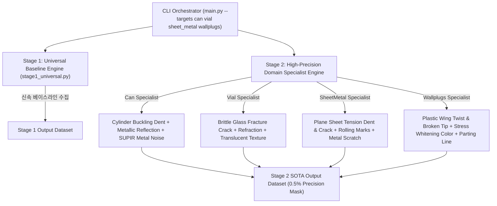

# Executive Summary

실전 딥러닝 결함 탐지에서 최고의 ROI와 SOTA mAP/Accuracy를 도출하기 위한 **2단계 하이브리드 결함 증강 전략(Two-Stage Hybrid Strategy)** 구현체입니다.

- **Stage 1 (Rapid Baseline)**: 범용 생성 프레임워크로 대상 품목에 대한 베이스라인 데이터셋과 모니터링 체계를 빠르게 수집 (Rapid Baseline Generation).
- **Stage 2 (High-Precision Specialization)**: 4대 핵심 난이도 품목 **`can` (알루미늄 캔)**, **`vial` (유리 약병)**, **`sheet_metal` (금속 판금)**, **`wallplugs` (플라스틱 앙카)**에 대해 소재 물리 법칙 및 광학 특성이 극대화된 **도메인 스페셜리스트 모듈**을 정밀 적용.

---

# Two-Stage Architecture



---

# Module Specifications

1. **`stage1_universal.py`**:
   - 범용 3D 기하 변형 맵과 기본 인페인팅 텍스처를 이용하여 빠른 베이스라인 결함 세트 자동 구성.
2. **`stage2_can_specialist.py`**:
   - `can` (알루미늄 캔): 원통 좌굴 응력(Cylinder Buckling Dent) 시뮬레이션 + 알루미늄 광택 반사광 합성 + SUPIR 헤어라인 금속 노이즈 복원.
3. **`stage2_vial_specialist.py`**:
   - `vial` (유리 약병): 유리 취성 파괴(Brittle Glass Fracture Crack) 미세 맵 생성 + 유리 굴절률(Glass Refraction Specular) 합성 + SUPIR 반투명 질감 복원.
4. **`stage2_sheetmetal_specialist.py`**:
   - `sheet_metal` (금속 판금): 평면 금속판 인장/전단 변형 시뮬레이션 + 압연 롤링 마크(Rolling Marks) 및 반사광 합성 + SUPIR 메탈 스크래치 복원.
5. **`stage2_wallplugs_specialist.py`**:
   - `wallplugs` (플라스틱 앙카): 사출 성형 플라스틱 앙카 3D 날개 휨 & 팁 부러짐 시뮬레이션 + 백화 현상(Stress Whitening) 표현 + SUPIR 사출 파팅라인 복원.
6. **`main.py`**:
   - Stage 1 ➔ Stage 2로 자동 전환되며 4대 타겟 품목에 스페셜리스트 모듈을 통합 적용하는 CLI 오케스트레이터.

---

# How to Run

```bash
cd D:\wiki\wiki\projects\KKCC\two_stage_hybrid_pipeline
python main.py --targets can vial sheet_metal wallplugs --num_stage1 10 --num_stage2 20
```

---

# Output Directory Structure

```
D:\KKCC_Project\two_stage_hybrid_output\
├── stage1_universal/
│   ├── can/
│   ├── vial/
│   ├── sheet_metal/
│   └── wallplugs/
└── stage2_specialized/
    ├── can/ (SOTA metallic dent images, 0.5% precision masks)
    ├── vial/ (SOTA glass fracture crack images, 0.5% precision masks)
    ├── sheet_metal/ (SOTA metal sheet tension dent/crack images, 0.5% precision masks)
    └── wallplugs/ (SOTA plastic wallplug deformation images, 0.5% precision masks)
```

---

# Related Documents

- [KKCC 전 품목 대응 범용 하이브리드 결함 증강 프레임워크](../universal_hybrid_pipeline/README.md)
- [KKCC MVTec AD 2 can 하이브리드 파이프라인](../can_hybrid_pipeline/README.md)
- [Artificial Image Data for Visual Defect Detection SLR](../../wiki/papers/artificial-image-data-for-defect-detection.md)
