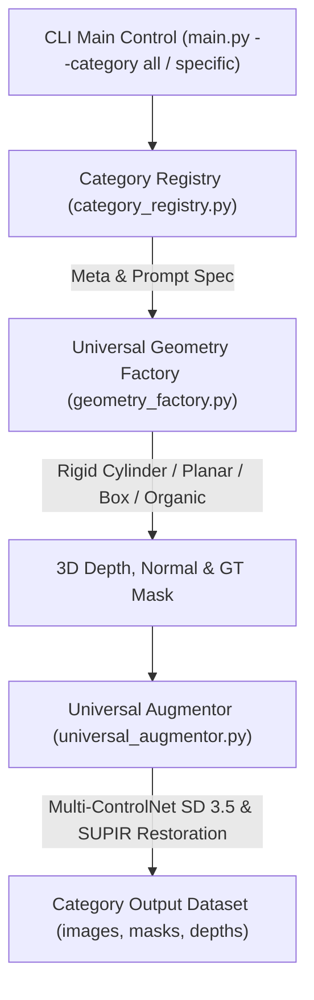

# Overview

단일 품목에 국한되지 않고, MVTec AD 1 및 MVTec AD 2 데이터셋에 존재하는 **23개 전 품목(Can, Sheet Metal, Vial, Wallplugs, Fabric, Rice, Bottle, Cable 등)**에 대해 카테고리별 물리 형상 및 재질(Metal, Glass, Plastic, Fabric, Wood, Food 등)을 자동 식별하여 **3D 기하 시뮬레이션 + ControlNet SD 3.5 + SUPIR 복원**을 적용하는 범용 데이터 증강 프레임워크입니다.

---

# Architecture



---

# Key Components

1. **`category_registry.py`**:
   - MVTec AD 1(15개) + MVTec AD 2(8개) 총 23개 전 카테고리의 3D Geometry Type, Material, Prompt, Defect Type 메타데이터 레지스트리.
2. **`geometry_factory.py`**:
   - `rigid_cylinder` (Can, Vial, Bottle, Cable 등), `planar_surface` (Sheet Metal, Fabric, Tile, Leather 등), `rigid_box` (Wallplugs, Nut, Screw 등), `organic_particle` (Rice, Walnuts, Hazelnut 등) 4가지 범용 3D/시뮬레이션 기하 팩토리.
3. **`universal_augmentor.py`**:
   - 카테고리 재질(Metal, Glass, Plastic, Fabric, Ceramic 등) 특성에 맞춘 SD 3.5 텍스처 합성 및 SUPIR 초고해상도 결 복원 모듈.
4. **`main.py`**:
   - 전 품목 일괄 실행 (`--category all`) 또는 특정 품목 타겟 실행 (`--category sheet_metal`)을 지원하는 CLI 관제 스크립트.

---

# How to Run

### 1. 특정 품목 타겟 생성 (예: sheet_metal)
```bash
cd D:\wiki\wiki\projects\KKCC\universal_hybrid_pipeline
python main.py --category sheet_metal --num_samples 10
```

### 2. MVTec AD 1 & 2 전 품목 일괄 자동 생성 (23개 카테고리)
```bash
python main.py --category all --num_samples 5
```

---

# Related Documents

- [KKCC MVTec AD 2 can 하이브리드 파이프라인](../can_hybrid_pipeline/README.md)
- [KKCC Model B 파이프라인 개요](../pipeline.md)
- [Artificial Image Data for Visual Defect Detection SLR](../../wiki/papers/artificial-image-data-for-defect-detection.md)
